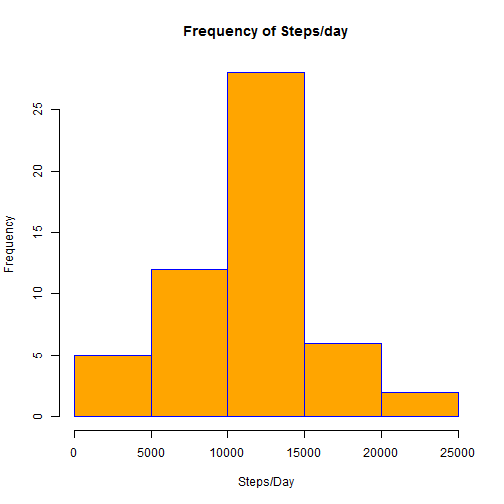
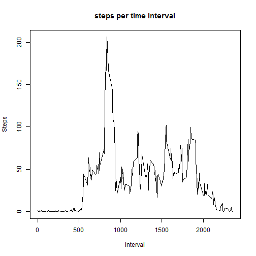
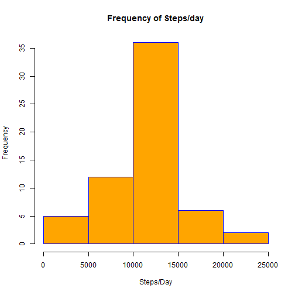
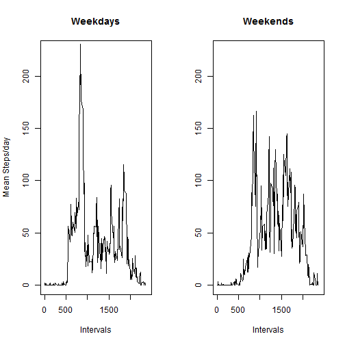

## Loading and preprocessing the data

Read the data file in.

```r
steps<-read.csv("activity.csv",header=TRUE, sep=",")
steps_good<-subset(steps, !is.na(steps))
```

Sum the number of steps per day

```r
steps_day<-aggregate(steps~date, data=steps_good, sum)
```

Create a histogram of the results

```r
hist(steps_day$steps, main="Frequency of Steps/day", xlab="Steps/Day", border="blue", col="orange")
```



# What is the mean total number of steps taken per day?
Calculate the mean of the steps per day

```r
mean_steps<-mean(steps_day$steps)
mean_steps
```

```
## [1] 10766.19
```
Calculate the median of the steps per day

```r
med_steps<-median(steps_day$steps)
med_steps
```

```
## [1] 10765
```

#What is the average daily activity pattern?

Get the average steps per 5 minute interval

```r
step_5min<-aggregate(steps~interval, data=steps_good, mean)
```
Plot steps against time interval, averaged across all days

```r
plot(step_5min$interval,step_5min$steps, type="l", main="steps per time interval",ylab="Steps",xlab="Interval")
```



On average, which interval during the day has the most steps.

```r
step_5min$interval[which.max(step_5min$steps)]
```

```
## [1] 835
```

#Imputing missing values

How many NAs are there in the original table?

```r
  steps_na<-which(is.na(steps))
  length(steps_na)
```

```
## [1] 2304
```
Merge 5 minute interval with original steps table

```r
  steps_filled<-merge(steps, step_5min,by="interval")
```

Replace NA values with mean of steps values for that time interval

```r
  steps_na<-which(is.na(steps_filled$steps.x))
  steps_filled$steps.x[steps_na]<-steps_filled$steps.y[steps_na]
```

Create a histogram of the results

```r
steps_day_new<-aggregate(steps.x~date, data=steps_filled, sum)
hist(steps_day_new$steps.x, main="Frequency of Steps/day", xlab="Steps/Day", border="blue", col="orange")
```



It looks like the imputing of NA values increases the middle bar (mean/median) height, but other bars seem unchanged.


Calculate the new mean of the steps per day

```r
mean_steps<-mean(steps_day_new$steps.x)
mean_steps
```

```
## [1] 10766.19
```
Calculate the new median of the steps per day

```r
med_steps<-median(steps_day_new$steps.x)
med_steps
```

```
## [1] 10766.19
```

It looks like the mean did not change, but the median took on the value of the mean, now that some non-integer values were plugged in. 


#Are there differences in activity patterns between weekdays and weekends?
Regenerate steps_filled, and flag whether a date is a weekend or a weekday.
Convert resulting column to factor.

```r
  steps_filled<-merge(steps, step_5min,by="interval")
  steps_filled$steps.x[steps_na]<-steps_filled$steps.y[steps_na]
  steps_filled<-cbind(steps_filled, wkday=weekdays(as.Date(steps_filled$date)))
  steps_filled<-cbind(steps_filled,    day_type="", stringsAsFactors=FALSE)

  for(i in 1:nrow(steps_filled)){
    if(steps_filled$wkday[i] %in% c("Saturday","Sunday"))
      steps_filled$day_type[i]="Weekend"
    else
      steps_filled$day_type[i]="Weekday"
  }
  steps_filled$day_type<-as.factor(steps_filled$day_type)
```

Get average steps per interval and day_type

```r
steps_interval_day<-aggregate(steps_filled$steps.x,by=list(steps_filled$interval,steps_filled$day_type),mean)
```

Plot the weekend and weekday results in a panel plot.

```r
weekday_intervals<-subset(steps_interval_day, steps_interval_day$Group.2=="Weekday",select=c("Group.1","x"))
weekend_intervals<-subset(steps_interval_day, steps_interval_day$Group.2=="Weekend",select=c("Group.1","x"))
par(mfrow=c(1,2))
plot(weekday_intervals$Group.1,weekday_intervals$x,type="l",xlim=c(0,2400), ylim=c(0,225),main="Weekdays",xlab="Intervals",ylab="Mean Steps/day")
plot(weekend_intervals$Group.1,weekend_intervals$x,type="l",xlim=c(0,2400), ylim=c(0,225),main="Weekends",xlab="Intervals",ylab="")
```


